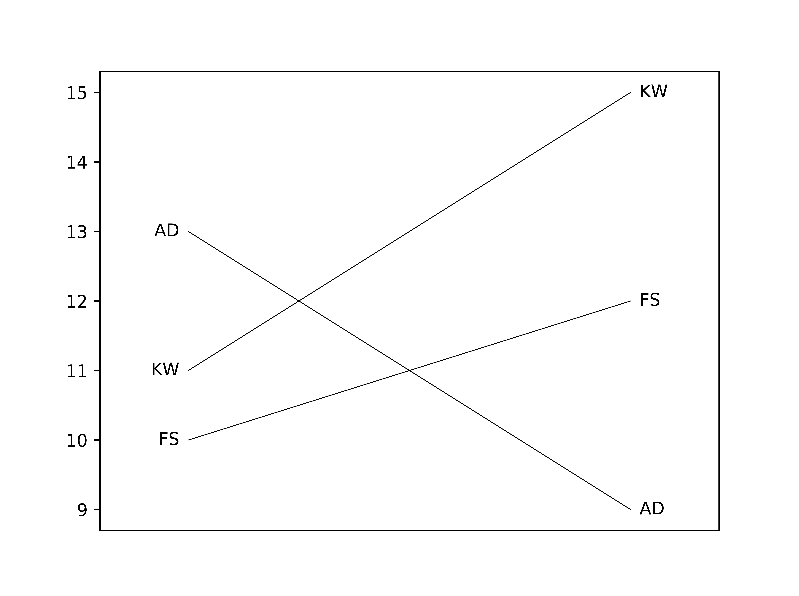
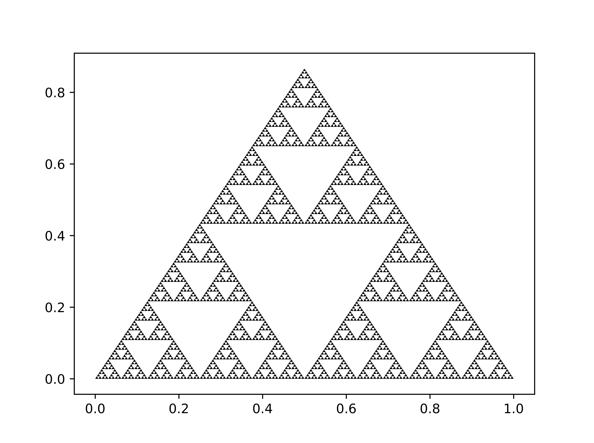

# Python Seminar 4: Matplotlib

```python
import numpy as np
import matplotlib.pyplot as plt

# First graph
x = np.linspace(0, 10, 100) # x coordinates
y = np.sin(x) # y coordinates

fig, axes = plt.subplots()
axes.plot(x, y)
fig.show()

# You can adjust line thickness, colours, etc.
# See the official documentation
fig, axes = plt.subplots()
axes.plot(x, y, linewidth = 0.5, color = 'red')
fig.show()

# Why not use nice colors?
# https://personal.sron.nl/~pault/
palette = {
    'blue':   '#4477AA',
    'cyan':   '#77CCEE',
    'green':  '#228833',
    'yellow': '#CCBB44',
    'red':    '#EE6677',
    'purple': '#AA3377',
    'grey':   '#BBBBBB'
}

fig, axes = plt.subplots()
axes.plot(x, y, linewidth = 0.5, color = palette['red'])
axes.plot(x + 1, y, linewidth = 0.5, color = palette['blue'])
fig.show()

# You also have scatter, bar chart, etc.
# I am not going to discuss those, it's all the same stuff
```

## Exercises

```python
# For beginners
data = {'FS': [10,12], 'KW': [11,15], 'AD': [13, 9]}

# Make the following graph
```



```python
# Solution
fig, axes = plt.subplots()
for k, v in data.items():
    axes.plot([0,1], v, linewidth = 0.5, color = 'black')
    axes.text(-0.02, v[0], k, horizontalalignment = 'right', verticalalignment = 'center')
    axes.text(1.02, v[1], k, horizontalalignment = 'left', verticalalignment = 'center')
axes.set_xlim(-0.2,1.2)
axes.set_xticks([])
fig.show()
#fig.savefig('python-matplotlib-beginners.png', dpi = 1200)

# For intermediate users
# Draw a Sierpinski triangle
```



```python
# Solution
w = 1
h = np.sqrt(w**2 - (w/2)**2)
xy = np.array([[0, w, w/2, 0], [0, 0, h, 0]])
dx = np.array([w/2, 0]).reshape(-1,1)
dy = np.array([w/4, h/2]).reshape(-1,1)
no_iter = 7

sierpinski = [xy]

def grow(s):
    r = []
    for t in  s:
        r.append(t/2)
        r.append(t/2 + dx)
        r.append(t/2 + dy)
    return r

for i in range(no_iter):
    sierpinski = grow(sierpinski)

fig, axes = plt.subplots()
for t in sierpinski:
    axes.fill(t[0], t[1], 'black')
fig.show()
#fig.savefig('python-matplotlib-intermediate.png', dpi = 1200)
```