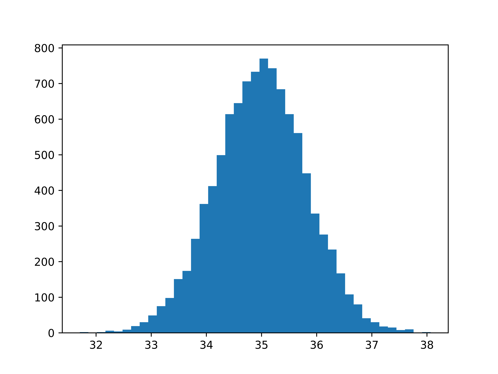
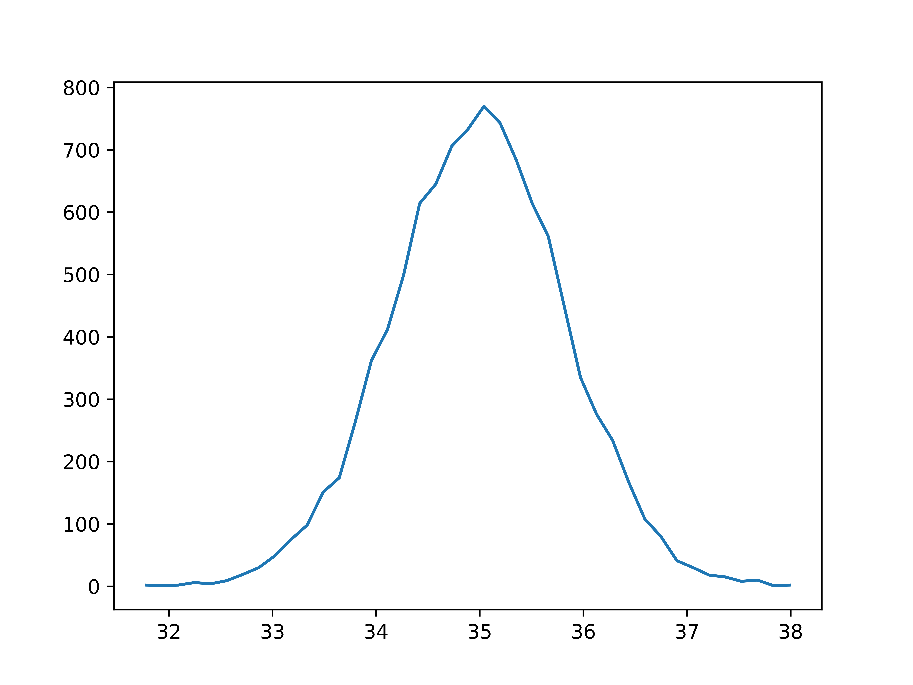
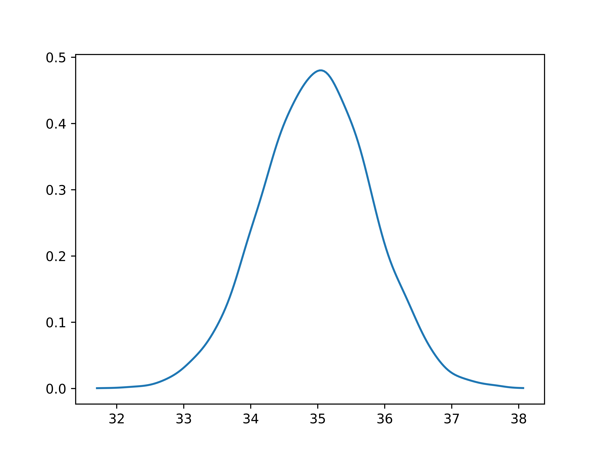

# Python Seminar 6: Econometrics

```python
# Load libraries
import numpy as np
import pandas as pd
import statsmodels.api as sm
import statsmodels.formula.api as smf
import matplotlib.pyplot as plt

# Construct a random dataset
noobs = 10
x = np.random.normal(size = (noobs, 2))
x = np.insert(x, 0, 1, axis = 1)
e = np.random.normal(size = noobs)
b = np.array([10, 20, 30])
y = x@b + e # or, y = np.dot(x, b) + e

# OLS with numpy
model = sm.OLS(y, x)
rslt = model.fit()
print(rslt.summary())
print(rslt.params)

# OLS with pandas
df = np.concatenate((y.reshape(-1,1), x), axis = 1)
df = pd.DataFrame(df, columns = ['y', 'const', 'x1', 'x2'])

model = smf.ols('y ~ x1 + x2', data = df)
rslt = model.fit()
print(rslt.summary())
print(rslt.params)

# For fixed effects regressions:
# from linearmodels import PanelOLS
# Note that the syntax is somewhat different
```

## Exercises

```python
# 1) Create random data with correlated x1 and x2
# 2) Estimate a linear model without using x2
# 3) Repeat 10,000 times, collect the estimates
# 4) Plot the histogram of the estimates

def mkdata(noobs):
    mean = [0, 0]
    cov = [[1, 0.5], [0.5, 1]]
    b = [10, 20, 30]
    x = np.random.multivariate_normal(mean, cov, noobs)
    x = np.insert(x, 0, 1, axis = 1)
    e = np.random.normal(size = noobs)
    y = x@b + e
    return y, x

# Let's test the correlation
y, x = mkdata(1000000)
print(np.corrcoef(x.T[1:]))

def beta(data):
    y, x = data
    model = sm.OLS(y, x[:,0:2])
    return model.fit().params[1]

b = [beta(mkdata(1000)) for i in range(10000)]

# Histogram (matplob)
fig, axes = plt.subplots()
axes.hist(b, bins = 41)
fig.show()
#fig.savefig('python-econometrics-histogram-1.png', dpi = 1200)
```



```python
# Histogram (numpy)
# Handy if you need several histograms on the same graph
y, x = np.histogram(b, bins = 41)
x = (x[1:] + x[:-1])/2

fig, axes = plt.subplots()
axes.plot(x, y)
fig.show()
#fig.savefig('python-econometrics-histogram-2.png', dpi = 1200)
```



```python
# Histogram with kernel smoothing
# (just for fun)
from scipy.stats import norm
x = np.linspace(min(b), max(b), 200)
m = norm.pdf(x.reshape(-1,1), loc = b, scale = 0.15)
y = np.mean(m, axis = 1)

fig, axes = plt.subplots()
axes.plot(x, y)
fig.show()
#fig.savefig('python-econometrics-histogram-3.png', dpi = 1200)
```


